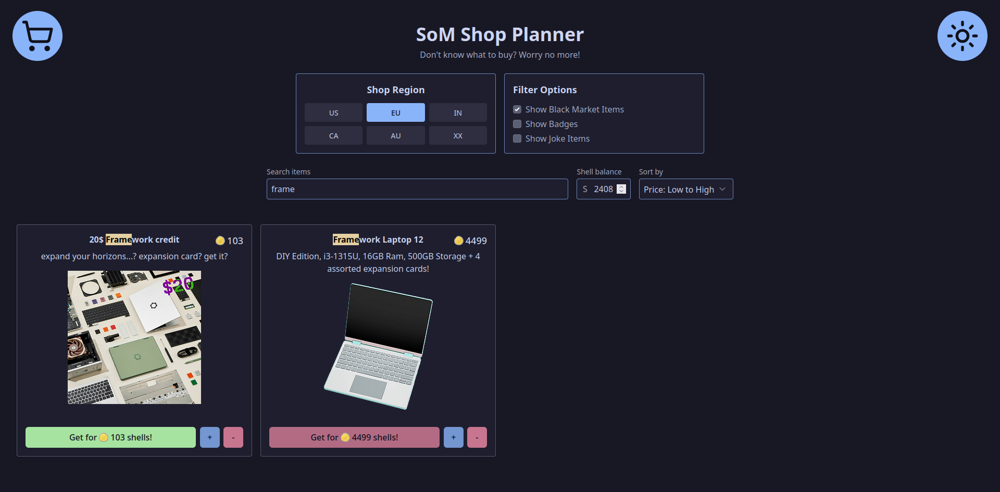

# SoM Shop Planner

Why would you need this? Ik ur gonna get 3 pairs of cat ears anyways :3

---

## What does it do?

The website lets you make your own "shopping cart" of items from [Summer of Making](https://github.com/hackclub/summer-of-making/) (using [SoM Monitor](https://github.com/nordstromlabs/som-monitor) for real time item data) to help you pick what stuff get!

## Usage

Just set how many shells you have and get shopping!

> [!TIP]
> Holding down `ctrl` will multiply every item change by 10!

## Why?

Because _why not_ :P
